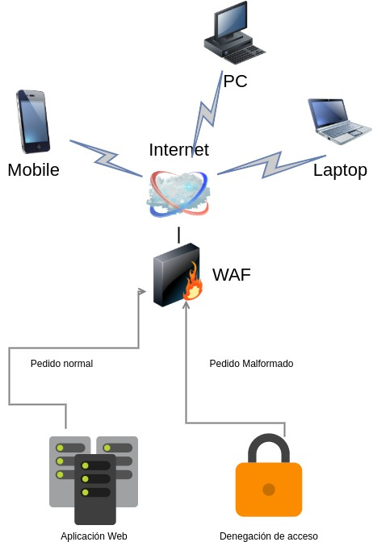
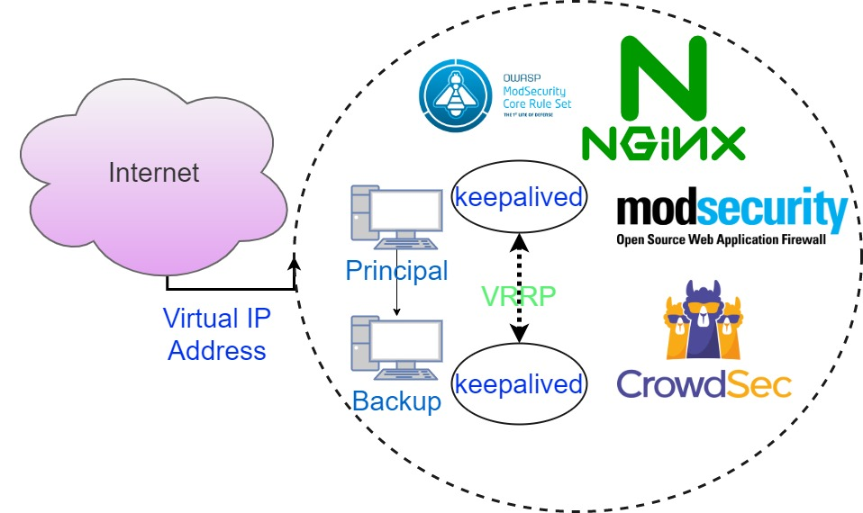

# WAF-NGINX
Configuración simple de WAF para servir sitios web y API's

## Contenidos

- 1 Firewall de Aplicaciones Web - WAF
    - 1.1 Introducción y objetivos
    - 1.2 Generalidades de un firewall de aplicaciones web
- 2 Propuesta
    - 2.1 Requerimientos e implementación
    - 2.2 Instalación
    - 2.3 Alta disponibilidad

## Introducción y objetivos

Debido a la deficiente seguridad en la detección y prevención de ataques más comunes a las aplicaciones web. Existe la necesidad de proveer de seguridad a aplicaciones web legadas las cuales no pueden ser actualizadas por motivos técnicos. Ante la imposibilidad de realizar cambios en el servidor de la aplicación y no poder realizar un desarrollo posterior sobre la misma, la propuesta es implementar una herramienta que funcione como proxy reverso que sea capaz de detectar y prevenir los riesgos más críticos en aplicaciones web funcionando como un **WAF**.

Un firewall de aplicaciones web (WAF) es un tipo de firewall que supervisa, filtra o bloquea el tráfico HTTP hacia y desde una aplicación web. Al inspeccionar el tráfico HTTP un WAF protege a las aplicaciones web contra ataques como los de inyección SQL, XSS y falsificación de petición de sitios cruzados (CSRF).

### Generalidades de un firewall de aplicaciones web

El firewall de aplicaciones web (WAF) ofrece una protección centralizada a las aplicaciones web contra vulnerabilidades de seguridad comunes. Las aplicaciones web son cada vez más el objetivo de ataques malintencionados que aprovechan vulnerabilidades habitualmente conocidas. Los scripts entre sitios y las inyecciones de código SQL están dentro de los ataques más comunes.

El firewall de aplicaciones web se basa en un conjunto de reglas básicas, las cuales pueden ser variadas como OWASP ModSecurity Core Rule Set y complementarse por medio de CrowdSec.

El modo de operación del WAF, es envolver la aplicación web y redirigir los pedidos sanitizados hacia ella.



### Agregando la funcionalidad de API Gateway

Un API Gateway gestiona todas las tareas relacionadas con la aceptación y procesamiento llamadas simultáneas a las APIs. Estas tareas pueden incluir la administración del tráfico, el control de la autorización y el acceso, el monitoreo y la administración de versiones de la API. Actúa como un punto de entrada único a todo el sistema. Todas las solicitudes de los clientes pasan primero por el API Gateway, luego este deriva las solicitudes al servicio o endpoint apropiado.

Una de las principales ventajas es que este encapsula la estructura interna de las servicios. Los clientes hablan con el API Gateway y este proporciona a cada tipo de cliente una API específica.

#### Generalidades de un API Gateway

Un API Gateway nos ayuda a resolver fácilmente cuestiones como:

- Habilitar autenticación para un endpoint
- Publicar un endpoint con un certificado SSL
- Reescritura avanzada de URI
- Limitar el consumo de un endpoint (rate limit)

Es importante establecer un proceso de actualización o publicación de nuevos servicios lo más rápido o automatizado posible.

### Puntos a determinar

En base a un plan de necesitades, determinar un dimensionamiento del API Gateway, teniendo en cuenta los siguientes puntos principales.

- Autenticación y autorizaciones
- Administración de certificados
- Re escritura de rutas - URI
- Manejo de errores
- Cache, buffers y transferencias de datos
- Definir los servicios o microservicios a exponer
- Definir los endpoint que consumiran las API
- Definir un consumo aceptable de los datos
- Establecer sistema de registro de datos de monitoreo y nivel de detalle de dichos datos

Como buena práctica definir el consumo de servicios a nivel proceso y a nivel técnico. A nivel proceso se determina el flujo correcto publicación y consumo de servicios. A nivel técnico se establecen mejores prácticas para dicho consumo.

Ejemplo de consumo del dato :

```
curl -ik --header "apikey:/ZkKxb0WYcqS8DRgn+e0aw==" --request GET  https://cursos.io/api/coursesstore/catalog/courses
```


## Propuesta

Se propone utilizar el software Nginx, es de código abierto y utilizado en sistemas linux como servidor web o como proxy reverso para reenviar mensajes de registro en una red. Apoyándose en **modSecurity** y **CrowdSec**.

modSecurity™ es un firewall de aplicaciones Web embebible que ejecuta como módulo del servidor web, provee protección contra diversos ataques hacia aplicaciones Web y permite monitorizar tráfico HTTP, así como realizar análisis en tiempo real sin necesidad de hacer cambios a la infraestructura existente.

CrowdSec es un IPS colaborativo y de código abierto. Analice comportamientos, responda a ataques y recibe señales de detección de fuentes cloud comunitarias.

modSecurity se integra en Nginx para que este pueda tomar las determinaciones necesarias.

Por otro lado CrowdSec corre por fuera de Nginx, sirviendo de apoyo.

- CrowdSec se instalará con opciones básicas de análisis de eventos, en primera instancia como monitoreo y luego se implementarán bloqueos.
- ModSecurity se instalará con las configuraciones de OWASP ModSecurity Core Rule Set.

### Requerimientos e implementación

Dependiendo del tráfico del sitio web, los requerimientos pueden variar, así que hay que determinar los requisitos normales de un proxy reverso con NGINX y sus módulos necesarios para luego sumarles los requisitos de procesamientos de solicitudes de tráfico HTTP/HTTPS por medio de  **modSecurity** y **CrowdSec**.

Se debe determinar y testear 
- Utilización de certificados SSL 
- Casos de prueba de las aplicaciones afectadas en cuestión
   - Correr aplicaciones de testeo de seguridad com OpenVAS, Nikto, Nmap+NSE,wpscan etc
- Dimensionamiento de recursos en base a las estadisticas de utilización del servidor

### Tareas administrativas de implementación

#### Primer etapa - Instalación

En base a una previa determinación de recursos, realizar las siguientes tareas: 

- Instalación de Sistema Operativo
    - Instalación Crowdsec
    - Instalación modSecurity
- Configuración del servicio
- Puesta en marcha

#### Segunda etapa - Definir roles operativos

- Definir tareas administrativas para su mantenimiento
- Definir responsables
- Determinar monitoreos para poder tener un Capacity planning

### Tercer etapa - Testeo

- Verificar correcto funcionamiento de las aplicaciones Web
- Intercambiar datos con usuarios clave
- Simular scaneos y ataques automatizados
- Verificar reportes de ataques recibios en etapa de pruebas

### Cuarta etapa - Go Live!

- Documento final y presentación de funcionamiento
- Determinar ahorro y compliance con normas aplicables
- Revisión de un informe preliminar de funcionamiento de toda la primer semana
- Revisión DNS y reglas de firewall
- Salida en productivo

### Implementación técnica

#### Instalación modSecurity™

```
$ sudo apt update
```

```
$ sudo apt install make gcc build-essential autoconf automake libtool libfuzzy-dev ssdeep gettext pkg-config libcurl4-openssl-dev liblua5.3-dev libpcre3 libpcre3-dev libxml2 libxml2-dev libyajl-dev doxygen libcurl4 libgeoip-dev libssl-dev zlib1g-dev libxslt-dev liblmdb-dev libpcre++-dev libgd-dev
```

```
$ sudo apt install nginx-core nginx-common nginx nginx-full
```

```
$ sudo mkdir -p /usr/local/src/nginx 
```

```
$ sudo chown username:username -R /usr/local/src/
```

```
$ cd /usr/local/src/nginx 
```

```
$ sudo apt source nginx
```

```
$ sudo apt install libmodsecurity3
```

```
$ git clone --depth 1 -b v3/master --single-branch https://github.com/SpiderLabs/ModSecurity /usr/local/src/ModSecurity/
```

```
$ cd /usr/local/src/ModSecurity/
```

```
$ sudo git submodule init
$ sudo git submodule update
```

```
$ sudo ./build.sh 
$ sudo ./configure
```

```
$ sudo make -j4
```

```
$ sudo make install
```

```
$ git clone --depth 1 https://github.com/SpiderLabs/ModSecurity-nginx.git /usr/local/src/ModSecurity-nginx/
```

```
$ cd /usr/local/src/nginx/nginx-1.x/
```

```
$ sudo apt build-dep nginx
$ sudo apt install uuid-dev
```

```
$ sudo ./configure --with-compat --add-dynamic-module=/usr/local/src/ModSecurity-nginx
```

```
$ sudo make modules
```

```
$ sudo cp objs/ngx_http_modsecurity_module.so /usr/share/nginx/modules/
```

```
$ sudo vim /etc/nginx/nginx.conf
```

```
load_module modules/ngx_http_modsecurity_module.so;
```

```
modsecurity on;
modsecurity_rules_file /etc/nginx/modsec/main.conf;
```

```
$ sudo mkdir /etc/nginx/modsec/
```

```
$ sudo cp /usr/local/src/ModSecurity/modsecurity.conf-recommended /etc/nginx/modsec/modsecurity.conf
```

```
$ sudo vim /etc/nginx/modsec/modsecurity.conf
```

```
SecRuleEngine DetectionOnly
```

```
SecRuleEngine On
```

```
$ sudo vim  /etc/nginx/modsec/main.conf
```

```
Include /etc/nginx/modsec/modsecurity.conf
```

```
$ sudo cp /usr/local/src/ModSecurity/unicode.mapping /etc/nginx/modsec/
```

```
$ sudo nginx -t
```

```
$ sudo systemctl restart nginx
```

```
$ sudo systemctl status nginx
```

```
$ wget https://github.com/coreruleset/coreruleset/archive/v3.3.4.tar.gz
```

```
$ tar xvf v3.3.4.tar.gz
```

```
$ sudo mv coreruleset-3.3.4/ /etc/nginx/modsec/
```

```
$ sudo mv /etc/nginx/modsec/coreruleset-3.3.4/crs-setup.conf.example /etc/nginx/modsec/coreruleset-3.3.4/crs-setup.conf
```

```
$ sudo vim /etc/nginx/modsec/main.conf
```

```
Include /etc/nginx/modsec/coreruleset-3.3.4/crs-setup.conf
Include /etc/nginx/modsec/coreruleset-3.3.4/rules/*.conf
```

```
$ sudo systemctl restart nginx
```

```
$ sudo vim /etc/nginx/modsec/modsecurity.conf
```

```
SecRule ARGS:testparam "@contains test" "id:254,deny,status:403,msg:'Test Successful'"
```

```
$ sudo systemctl restart nginx
```

```
$ cat /var/log/nginx/error.log | grep "Test Successful"
```

#### Instalación CrowdSec

```
curl -s https://packagecloud.io/install/repositories/crowdsec/crowdsec/script.deb.sh | sudo bash
```

```
apt install crowdsec
```

```
cscli collections install crowdsecurity/base-http-scenarios
cscli collections install crowdsecurity/http-cve
cscli collections install crowdsecurity/linux-lpe
cscli collections install crowdsecurity/modsecurity
cscli collections install crowdsecurity/nginx
```

```
apt-get install crowdsec-nginx-bouncer
```

### Adicionar un sitio a cubrir detrás de proxy reverso

```
server {
    location / {
	proxy_pass http://subdominio.dominiointerno.com;
    }
    listen 443 ssl;
    ssl_certificate /etc/letsencrypt/live/subdominio.dominio.com/fullchain.pem;
    ssl_certificate_key /etc/letsencrypt/live/subdominio.dominio.com/privkey.pem;
    include /etc/letsencrypt/options-ssl-nginx.conf;
    ssl_dhparam /etc/letsencrypt/ssl-dhparams.pem;
    server_name subdominio.dominio.com;
}

server {
    if ($host = subdominio.dominio.com) {
        return 301 https://$host$request_uri;
    }

    listen 80 ;
    server_name subdominio.dominio.com;
    return 404;
}
```
Habilitación del sitio :
```
# ln -s /etc/nginx/sites-available/subdominio.dominio.com /etc/nginx/sites-enabled
```
#### Adicionar certificado SSL por medio de Let's Encrypt

```
certbot certonly -d subdominio.dominio.com
```

### Alta disponibilidad

La infraestructura de alta diposnibilidad se implementará por medio del protocolo VRRP (Virtual Router Redundancy Protocol), haciendo uso del paquete Keepalived.



#### Nodo1 /etc/keepalived/keepalived.conf
```
vrrp_instance VI_1 {
        state BACKUP
        interface ens18
        virtual_router_id 51
        priority 254
        advert_int 1
        authentication {
              auth_type PASS
              auth_pass 12345
        }
        virtual_ipaddress {
              192.168.2.240/24
        }
}
```

#### Nodo2 /etc/keepalived/keepalived.conf
```
vrrp_instance VI_1 {
        state BACKUP
        interface ens18
        virtual_router_id 51
        priority 254
        advert_int 1
        authentication {
              auth_type PASS
              auth_pass 12345
        }
        virtual_ipaddress {
              192.168.2.240/24
        }
}
```


### Referencias relacionadas

## Proyectos

- https://crowdsec.net/
- https://github.com/SpiderLabs/ModSecurity-nginx
- https://github.com/coreruleset/coreruleset
- https://www.tecmint.com/install-modsecurity-nginx-debian-ubuntu/

## Reportes

- https://github.com/molu8bits/modsecurity-parser
- https://app.crowdsec.net/

